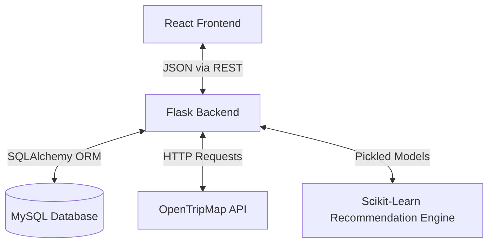

# System Architecture

When I set out to build this Tourism Recommendation System, I wanted an architecture that was robust enough to handle complex Machine Learning logic, but clean enough to easily maintain. I decided on a classic 3-tier decoupled architecture: **React (Frontend)** -> **Flask (Backend API)** -> **MySQL (Database)**, with a dedicated **Scikit-Learn (ML)** layer doing the heavy lifting.

Here is a deep dive into how the pieces fit together.

## The Big Picture

## 1. The Frontend (React)
I chose **React** (bootstrapped with Vite) for the frontend because a dynamic recommendation form requires a lot of state management (tracking budgets, activities, selected destinations, etc.). 
- **State Management:** I kept it simple using standard React hooks (`useState`, `useEffect`). No Redux needed here, as the state is localized to the form and the results page.
- **Styling:** I used pure Vanilla CSS. It gives me 100% control over the exact micro-animations and gradients I wanted without fighting against a utility framework.
- **Routing:** Handled by `react-router-dom`.

## 2. The Backend (Flask & Python)
I went with **Flask** over Node.js because Python is the undisputed king of Machine Learning. If I used Node for the backend, I would have had to build a weird microservice just to run the Scikit-learn models. Flask lets me serve the API and run the ML models in the exact same memory space.

I structured the backend using a standard MVC-inspired pattern:
- **Routes (`/routes`)**: The entry points. They do nothing but route traffic.
- **Controllers (`/controllers`)**: Parse incoming JSON and handle HTTP responses.
- **Services (`/services`)**: The "Brain". This is where the core business logic lives (like calling the ML engine or fetching data from the OpenTripMap API).
- **Repositories (`/repositories`)**: The Data layer. This strictly handles SQLAlchemy queries to keep the DB logic isolated.

## 3. The Recommendation Engine (Machine Learning)
This is the coolest part of the app. Instead of just doing a basic SQL `WHERE` clause (which is what most basic apps do), I built a custom content-based filtering engine.
1. **Vectorization:** When you submit the form, the backend turns your preferences (budget, activities, who you are traveling with) into a heavily weighted text profile.
2. **Cosine Similarity:** It uses a pre-trained `TfidfVectorizer` to convert your profile into a mathematical vector, and then calculates the `cosine_similarity` between your vector and every travel package in the database.

## 4. The Database (MySQL)
I used MySQL because relational data perfectly fits travel packages (Packages have Locations, Locations have Attractions). The database is entirely ephemeral in development—Docker automatically builds it and seeds it with dummy data scraped from Kaggle datasets every time you spin it up.

## 5. Docker Infrastructure
To prevent the classic *"it works on my machine"* problem, everything is containerized.
- The React app runs in an Alpine Node container.
- The Flask app runs in a slim Python container.
- The Database runs in the official MySQL container.
They all talk to each other seamlessly over a custom Docker bridge network.
