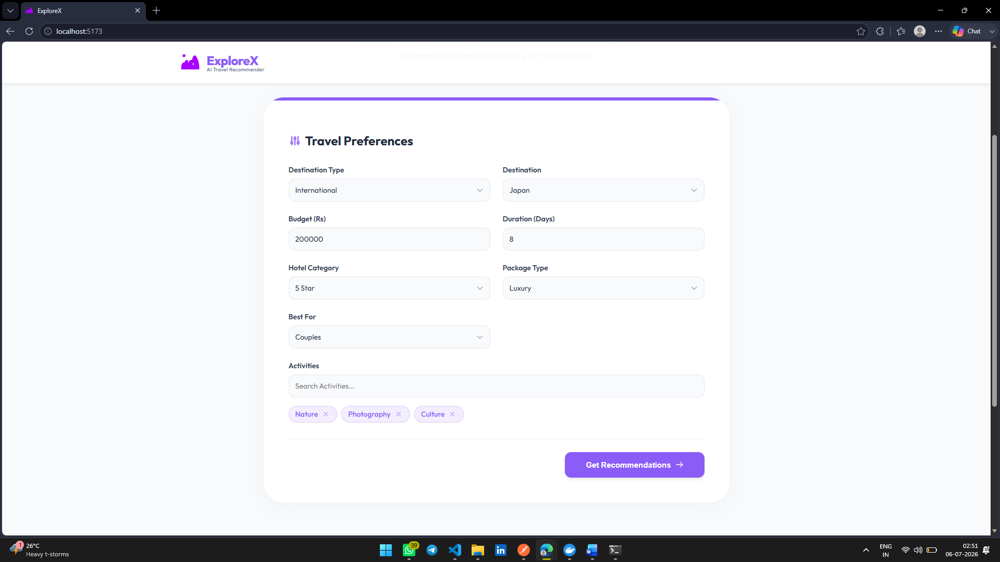
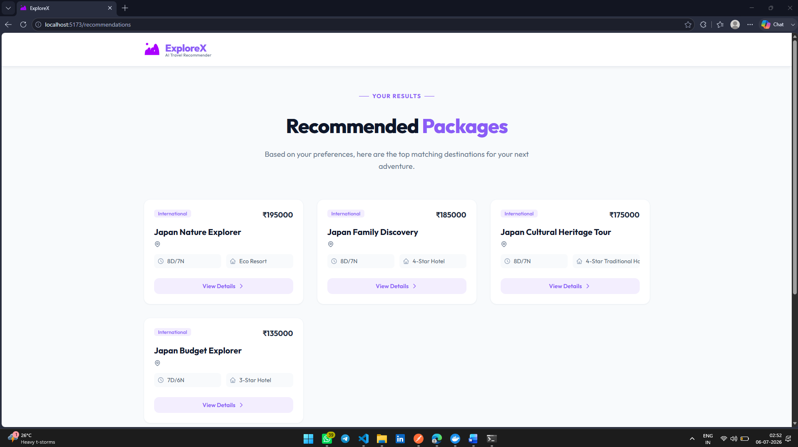
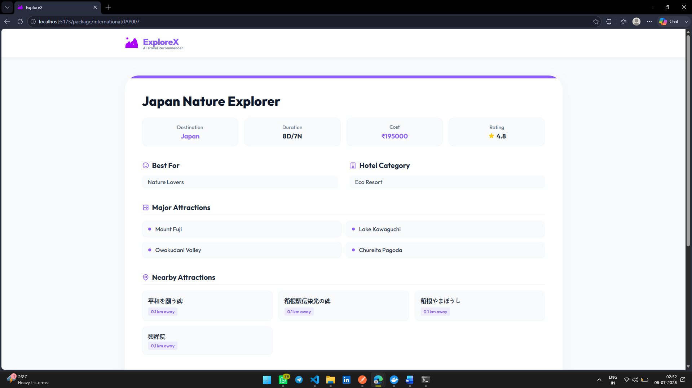
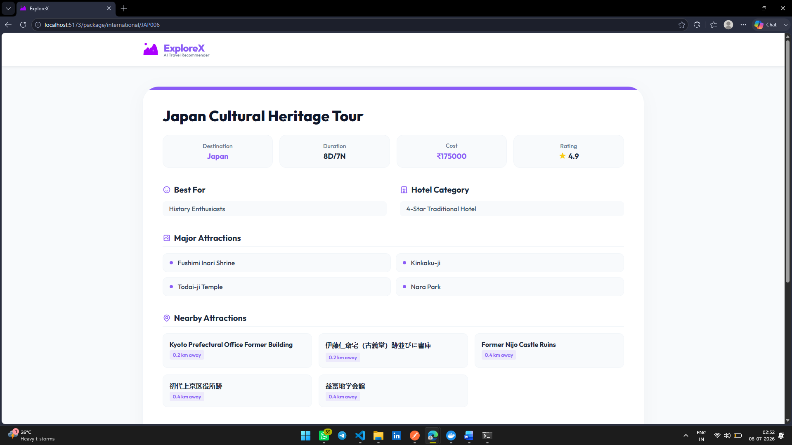

# Tourism Recommendation System

A comprehensive, full-stack Tourism Recommendation System designed to provide personalized travel experiences, destination suggestions, and trip packages based on user preferences.

## Features

- **Intelligent Recommendations**: Machine learning-based suggestions powered by Scikit-learn.
- **Interactive UI**: A modern, responsive user interface built with React, Vite, and Vanilla CSS.
- **Robust Backend**: Fast and scalable RESTful API built with Flask.
- **Relational Database**: Secure and structured data storage using MySQL and SQLAlchemy.
- **Containerized**: Fully dockerized environment for seamless deployment and development.

## Prerequisites

Make sure you have the following installed on your local machine:
- [Docker & Docker Compose](https://www.docker.com/products/docker-desktop/) (Recommended for easy setup)
- [Node.js](https://nodejs.org/) (If running the frontend manually)
- [Python 3.x](https://www.python.org/) (If running the backend manually)

## Getting Started (Docker)

The easiest way to get the application running is by using Docker.

1. **Clone the repository:**
   ```bash
   git clone https://github.com/Pratham082004/Tourism-Recommendation-System.git
   cd Tourism-Recommendation-System
   ```

2. **Run Docker Compose:**
   ```bash
   docker-compose up --build -d
   ```
   *This command will build the frontend, backend, and MySQL database containers and run them in detached mode.*

3. **Access the application:**
   - **Frontend:** http://localhost:5173
   - **Backend API:** http://localhost:5000
   - **Database (MySQL):** `localhost:3306`

Navigate to http://localhost:5173 to view the application.

## Manual Setup

If you prefer to run the system without Docker, follow these steps:

### 1. Database Setup
Ensure you have a local MySQL instance running. Create a `.env` file in the `backend/` directory by copying `.env.example` and updating the database credentials.

### 2. Backend Setup
```bash
cd backend
python -m venv venv
source venv/bin/activate  # On Windows: venv\Scripts\activate
pip install -r requirements.txt
python app.py
```

### 3. Frontend Setup
```bash
cd frontend
npm install
npm run dev
```
Navigate to http://localhost:5173 to view the application.

## Project Structure

```text
Tourism-Recommendation-System/
│
├── backend/                  # Flask backend & ML logic
│   ├── app.py                # Application entry point
│   ├── config.py             # Configuration files
│   ├── controllers/          # API route handlers
│   ├── database/             # Database connection logic
│   ├── ml/                   # Machine learning models
│   ├── routes/               # API blueprints
│   ├── services/             # Core business logic
│   └── requirements.txt      # Python dependencies
│
├── frontend/                 # React frontend
│   ├── public/               # Static assets
│   ├── src/                  # React source code
│   ├── package.json          # Node dependencies
│   └── vite.config.js        # Vite configuration
│
├── mysql-db/                 # Custom MySQL docker setup
│
├── docker-compose.yml        # Docker configuration
└── README.md                 # Project documentation
```

---

## Tech Stack

Frontend: React (JavaScript dialect)  
Backend: Flask (Python web framework for building APIs)  
Database: MySQL (Relational Database to store our data)  
Machine Learning: Scikit-learn (To provide intelligent recommendations)  
Containerization Platform: Docker (To pack an application and all of its dependencies into a single unit called a container and run on any system that has Docker installed)  

## Referred Sites

https://react.dev/  
https://flask.palletsprojects.com/  
https://www.mysql.com/  
https://www.docker.com/  
https://scikit-learn.org/  
https://vitejs.dev/  
https://www.makemytrip.com/holidays-india/  
https://www.thomascook.in/  

## Dataset and Open-Source APIs Referred

*(Note: The following datasets and APIs were used as references to create a dummy dataset for the database)*

Kaggle Dataset : https://www.kaggle.com/datasets/dhrubangtalukdar/top-indian-places-to-visit-indian-tourism  
Kaggle Dataset : https://www.kaggle.com/datasets/rkiattisak/traveler-trip-data/data  
Open-Source API : https://dev.opentripmap.org/docs  

## Tourism Recommendation System Screenshots

### UI Screenshots
  
  
  
  

### Database Screenshots
  

### API Screenshots
  
  
 
### Docker Screenshots
  


 

