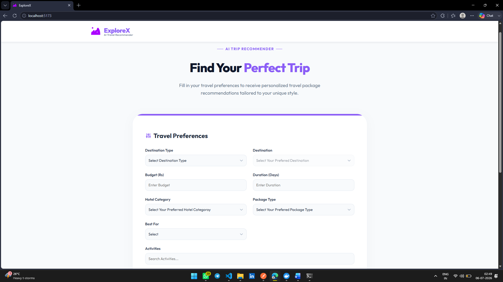
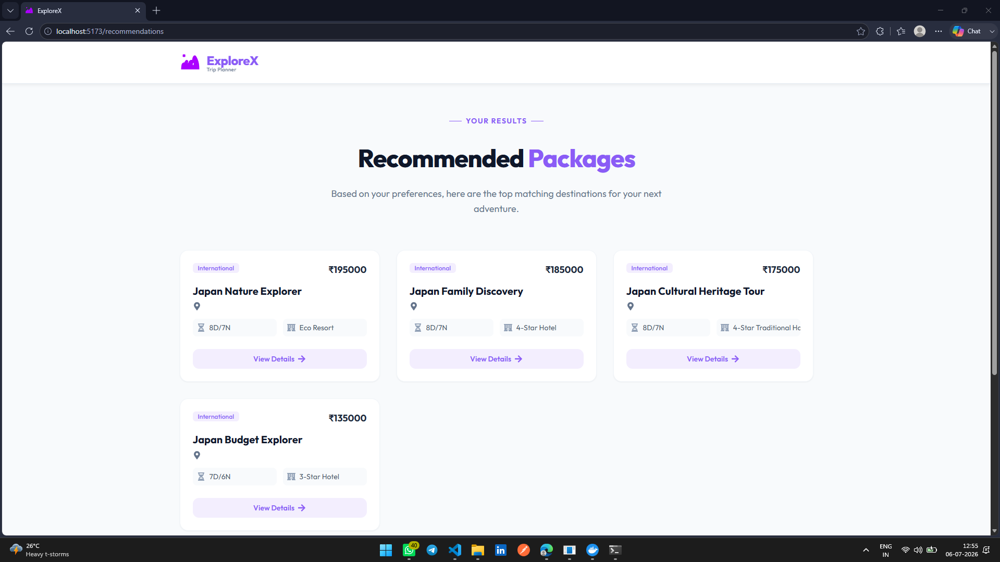
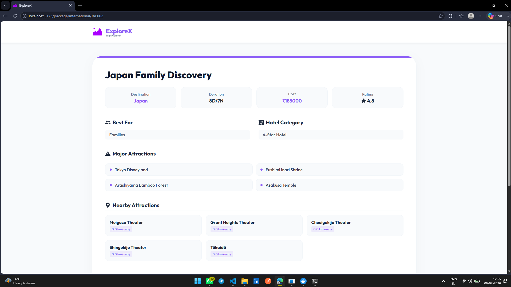
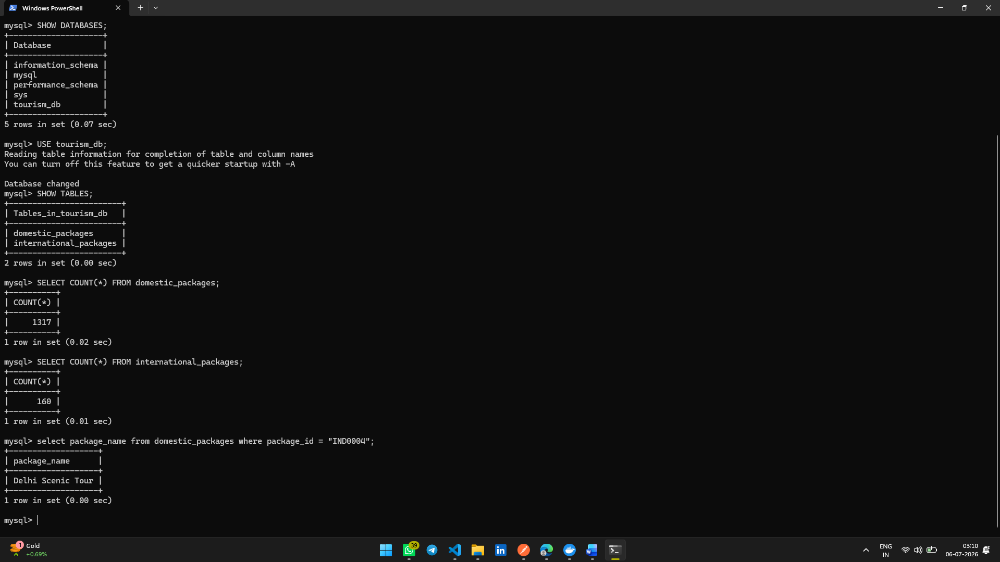
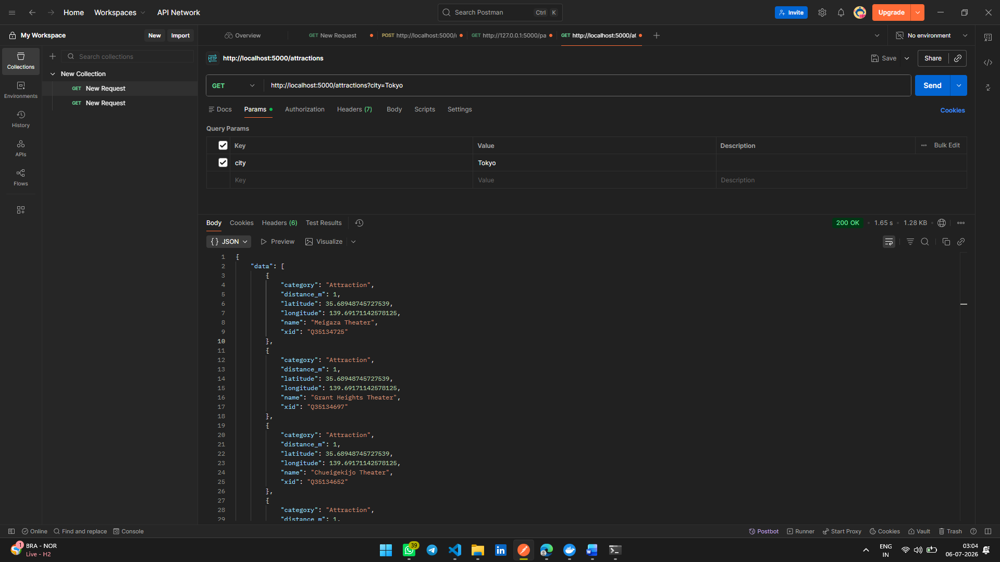
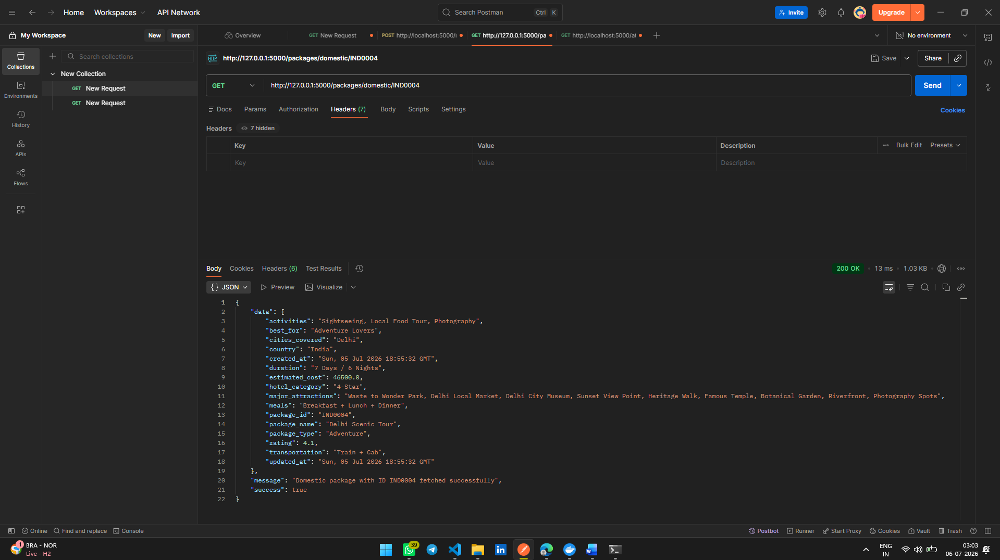
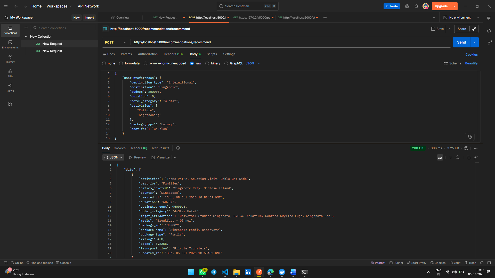
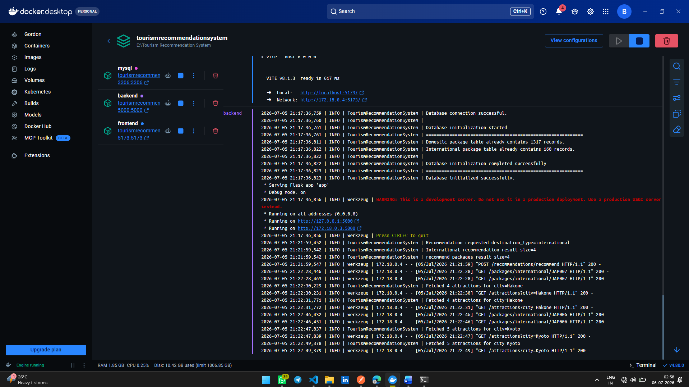
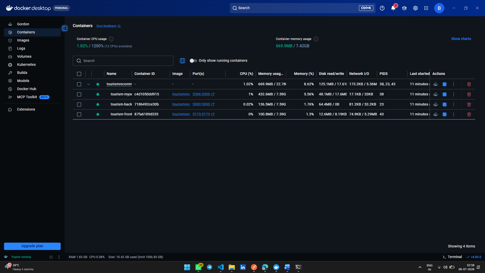

# ExploreX - Tourism Recommendation System

A comprehensive, full-stack Tourism Recommendation System designed to provide personalized travel experiences, destination suggestions, and trip packages based on user preferences.  

## 1. What it does
You input your travel preferences (e.g., budget, duration, activities like scuba diving), and your preferred destination type (Domestic or International). The system queries a database of travel packages and mathematically scores them against your profile, returning the top 5 best fits along with a dynamic map of nearby attractions.

## 2. Why I chose this project
Planning a trip can often be overwhelming due to the sheer number of choices and destinations available. I have personally spent hours bouncing between static travel websites trying to find a package that perfectly fits my budget and niche activity interests. I built ExploreX because it is a tool I genuinely needed—an intelligent travel agent that eliminates the guesswork and programmatically connects travelers to the right packages based on their actual constraints.

## 3. What is special about it
Instead of just using basic SQL `WHERE` clauses (which is what most basic search bars do), ExploreX uses a weighted content-based filtering algorithm powered by Scikit-learn. The system converts your preferences into a mathematical vector and calculates the cosine similarity against every package. It also applies hard mathematical penalties if a package exceeds your budget or time constraints, ensuring you only see truly viable options.

## Documentation

I have split the documentation into dedicated files to keep this README clean:

- **[Architecture Deep-Dive](ARCHITECTURE.md)**: Explains the Flask/React/Scikit-learn infrastructure and the ML Cosine Similarity engine.
- **[Installation & Setup Guide](INSTALL.md)**: Step-by-step instructions for running this project via Docker (Plug & Play) or Manual setup.
- **[API Documentation](API_DOCUMENTATION.md)**: A complete list of all RESTful endpoints, expected JSON payloads, and responses.

## Project Structure

```text
Tourism-Recommendation-System/
│
├── backend/                  # Flask backend & ML logic
│   ├── app.py                # Application entry point
│   ├── config.py             # Configuration files
│   ├── controllers/          # API route handlers
│   ├── database/             # Database connection logic
│   ├── ml/                   # Machine learning models
│   ├── routes/               # API blueprints
│   ├── services/             # Core business logic
│   └── requirements.txt      # Python dependencies
│
├── frontend/                 # React frontend
│   ├── public/               # Static assets
│   ├── src/                  # React source code
│   ├── package.json          # Node dependencies
│   └── vite.config.js        # Vite configuration
│
├── mysql-db/                 # Custom MySQL docker setup
│
├── docker-compose.yml        # Docker configuration
└── README.md                 # Project documentation
```

---

## Tech Stack

Frontend: React (JavaScript dialect), Vite  
Backend: Flask (Python web framework for building APIs)  
Database: MySQL (Relational Database to store our data)  
Machine Learning: Scikit-learn (To provide intelligent recommendations)  
Containerization Platform: Docker (To pack an application and all of its dependencies into a single unit called a container and run on any system that has Docker installed)  

## Referred Sites

https://react.dev/  
https://flask.palletsprojects.com/  
https://www.mysql.com/  
https://www.docker.com/  
https://scikit-learn.org/  
https://vitejs.dev/  
https://www.makemytrip.com/holidays-india/  
https://www.thomascook.in/  

## Dataset and Open-Source APIs Referred

*(Note: The following datasets and APIs were used as references to create a dummy dataset for the database)*

Kaggle Dataset : https://www.kaggle.com/datasets/dhrubangtalukdar/top-indian-places-to-visit-indian-tourism  
Kaggle Dataset : https://www.kaggle.com/datasets/rkiattisak/traveler-trip-data/data  
Open-Source API : https://dev.opentripmap.org/docs  

## AI Usage Declaration

To be fully transparent, I used AI tools (like ChatGPT/Copilot) to help speed up repetitive tasks in this project:
- **Data Generation:** I used AI to help format and generate the dummy MySQL data based on the Kaggle datasets, as writing hundreds of rows of SQL inserts by hand is incredibly tedious.  

Everything else React UI, Flask architecture, Scikit-learn cosine similarity logic, SQL database schema, and Docker infrastructure—was built by me.  

## ExploreX-Tourism Recommendation System Screenshots

### UI Screenshots
  
  
  
### Database Screenshots
  

### API Screenshots
  
  
 
### Docker Screenshots
  


 

